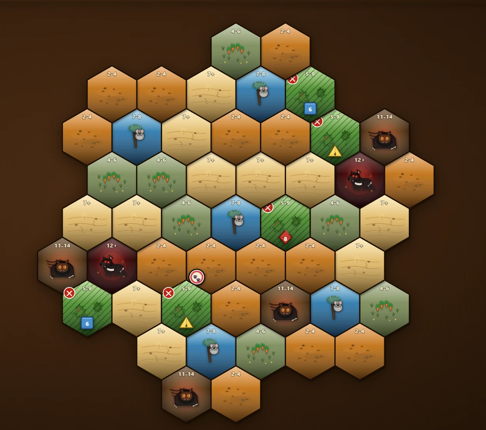
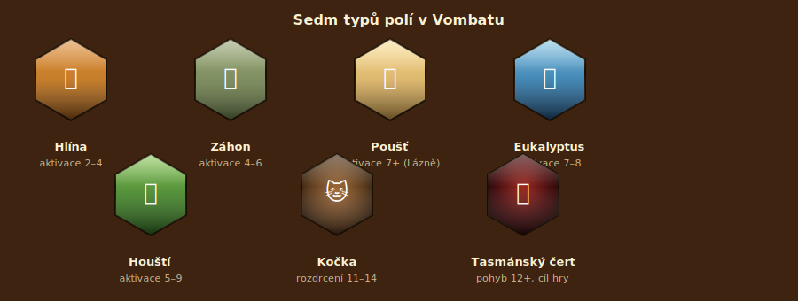
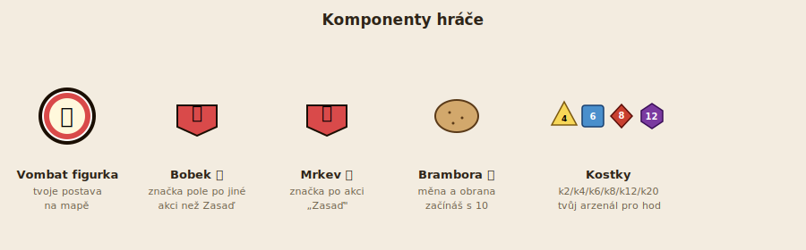
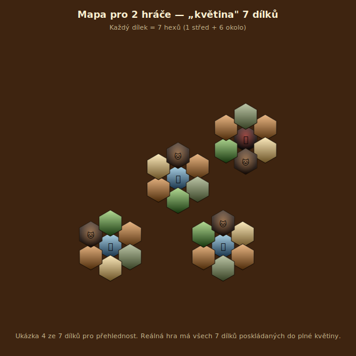
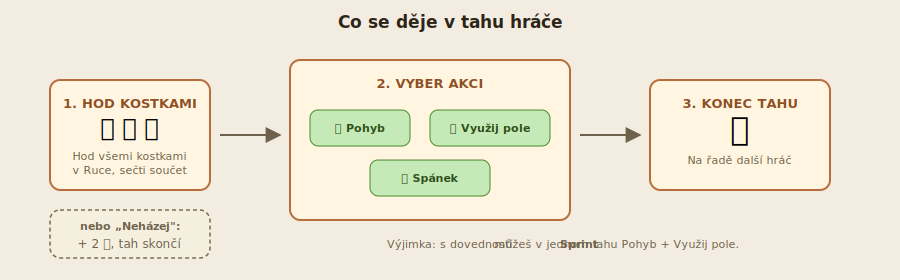
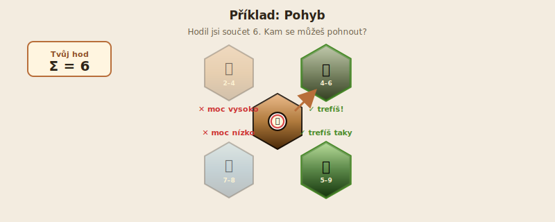
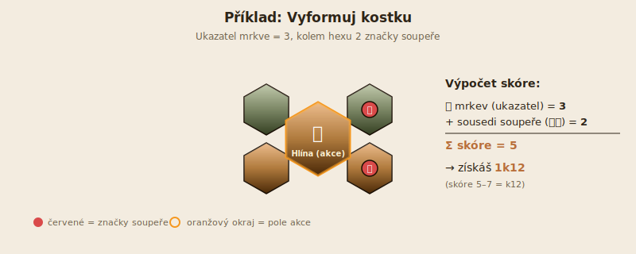
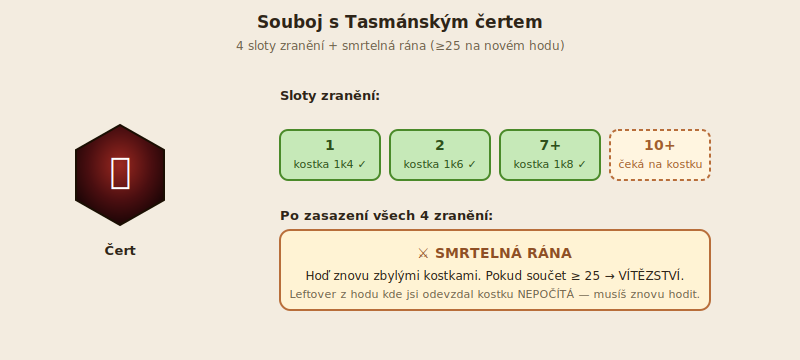
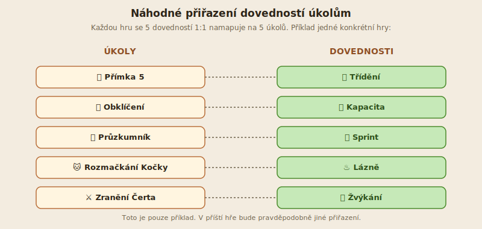

# Vombat & Co. — Inženýři krychlí

*Pravidla pro 2–4 hráče · 30–60 minut · od 10 let*



---

## 1. Vítejte ve hře

Hluboko v australském buši žijí **vombati** — chlupatá, podsaditá zvířata s nečekanou super-schopností. Jejich zadek je obrněný kost-deskou tak tvrdou, že se s ním vombat může opřít o stěnu nory a **rozdrtit predátora o strop**. (Ano, je to skutečný biologický fakt!)

A jako bonus: vombati **vyformovávají kostkové bobky**. Doslova krychlové. (Taky pravda!)

Jeden takový predátor zrovna teď ohrožuje vombatí rodinu — je to **Tasmánský čert**, vzteklý šelmovitý masožravec s vyceněnými fangs a žhnoucíma očima. Vašim úkolem je hodit po něm dost kostek, abyste mu nakonec zasadili **smrtelnou ránu zadkem**.

Než se ale do něj pustíte, musíte si vybudovat **arzenál kostek** — sbírejte je z Houští, formujte je na Hlíně, učte se schopnosti pod Eukalyptem. Pak jednoho dne (= jednoho tahu) přijde okamžik, kdy zaútočíte.

Hra kombinuje **hex mapu**, **hod kostkami** a **lehký deck-building**: postupně si vylepšujete sbírku kostek, zatímco lavírujete mezi soupeři, kočkami v křoví a tikajícím nebezpečím Čerta.

---

## 2. Cíl hry

**Hraješ za vombata.** Tvým hlavním úkolem je **rozdrtit Tasmánského čerta** dřív, než to stihnou soupeři.

Souboj s Čertem má dvě části:
1. **Zranit ho na 4 místech** (slotech).
2. Pak **hodit součet ≥ 25** na samostatném hodu = smrtelná rána.

**Vyhrává hráč, který Čerta rozdrtí jako první.** Hra ihned skončí.

> 💡 **Tip pro první hru:** Nepokoušej se na Čerta zaútočit ihned. Nejdřív si nasbírej víc kostek (k8+) a naučíš se nějakou dovednost.

---

## 3. Co najdete v krabici

### Hexagonální mapa
- **Dílky** s biomy (každý dílek = 7 hexagonálních polí). 7–9 dílků podle počtu hráčů.



### Druhy polí
| Symbol | Pole | K čemu slouží |
|---|---|---|
| 🟫 **Hlína** | oranžová | Sázení mrkve, formování kostek 💩 |
| 🌱 **Záhon** | šedo-zelená | Sázení mrkve (klíčové pro skóre formování) |
| 🌳 **Eukalyptus** | modrá | Učení dovedností (žvýkání listů) |
| 🌵 **Houští** | zelená | Sbírání kostek z trnitých keřů |
| 🏜️ **Poušť** | písková | Akce jako Hlína, ale jen s Lázněmi |
| 🐱 **Kočka** | hnědá | Nebezpečí + možná kořist (drtí se hod 11–14) |
| 👹 **Čert** | černá | Tvůj cíl. Tunelový vchod do bojiště. |

### Žetony a komponenty
- **Vombat figurka** 🐾 — tvoje postava na mapě (max 2 za hráče).
- **Bobek** 💩 — značíš jím pole, kde jsi udělal nepříjemnou akci (vše kromě sázení mrkve).
- **Mrkev** 🥕 — značíš jím pole, kde jsi zasadil mrkev.
- **Brambora** 🥔 — měna a obranný předmět. Začínáš s tím, co ti zbude po startovním nákupu.
- **Kostky** — k2, k4, k6, k8, k12, k20. *Pozn.: k10 ve hře neexistuje.* Tvoje "ruka" pro akce.



### Deska hráče
- **Ruka** — kostky, kterými budeš v tomto tahu házet (max 2 stejné velikosti).
- **Zásoba** — záložní kostky (max 3 kostky, nebo neomezené s Kapacitou).
- **Ukazatele** — kolik máš mrkve, eukalyptů a obsazených dílků mapy.

---

## 4. Příprava hry

### Krok 1: Slož mapu
Mapa se generuje automaticky podle počtu hráčů:

| Hráči | Dílků | Z toho Eukalypty 🌳 | Z toho Čerti 👹 |
|---|---|---|---|
| 2 | 7 | 5 | 2 |
| 3 | 8 | 5 | 3 |
| 4 | 9 | 5 | 4 |

Dílky se skládají do **„květiny"** — 1 centrální + 6 kolem (a pro 3-4 hráče + 1-2 vnější dílky).



### Krok 2: Na Houští se rozloží kostky
Náhodně, v poměru **2 : 2 : 1** pro k4 : k6 : k8. Tyto kostky pak hráči získávají hodem.

### Krok 3: Každý hráč si vezme
- 1 Vombata své barvy (druhý se kupuje v nákupu)
- 20 žetonů své barvy (Bobky + Mrkve)
- **10 brambor** 🥔
- Desku hráče

### Krok 4: Náhodně zvolte začínajícího hráče

### Krok 5: Umístění Vombatů
Po směru hodinových ručiček každý hráč postupně umístí svého prvního Vombata na libovolné pole mapy.

> **Omezení:** Nelze začít na poli Kočky 🐱 ani Čerta 👹.
> **Tip:** Pole sousedící s živou Kočkou jsou riziková — pokud později hodíš málo, kočka tě napadne.


> Na obrázku vidíš: 🟫 Hlína (oranžová), 🌱 Záhon s mrkvemi (zelená), 🐨 Eukalyptus s koalou (modrá), 🌵 Houští s kostkami (zelené pruhy), 🏜️ Poušť (písková), 🐱 Kočka s žlutýma očima (hnědá), 👹 Tasmánský čert (rudě-černá). Bílý kruh s tlapkou 🐾 je Vombat hráče.

### Krok 6: Startovní nákup
Každý hráč si musí koupit **alespoň 1 kostku**. Zbylé brambory zůstávají do hry.

| Předmět | Cena |
|---|---|
| 1k2 | 5 🥔 |
| 1k4 | 6 🥔 |
| 1k6 | 8 🥔 |
| 1k8 | 10 🥔 |
| 1k12 | 10 🥔 |
| Druhý Vombat | 5 🥔 |

> **Pozor:** k20 si nelze koupit. Lze ji jen získat ve hře (vysokým skóre formování, upgrade Žvýkáním, nebo 1. místem v úkolu Přímka 5).

> **Tip pro první hru:** Vezmi si 1k8 — pokrývá širokou paletu polí (Hlína, Záhon, Eukalyptus, Houští). Zbylé 2 🥔 si schovej.

---

## 5. Jak hra probíhá

### Velký obrázek
Hráči se **střídají v tazích**. Hra běží, dokud někdo nesplní cíl (rozdrcení Čerta). Hra nemá pevný počet kol — někdy končí za 15 tahů, někdy za 30.

### Co se děje v jednom kole
Každý hráč postupně odehraje 1 tah. Pak je na řadě další. Není kolo formálně rozdělené — prostě sekvence tahů.

### Co dělá hráč ve svém tahu
Ve zkratce: **hodí kostkami → vybere jednu akci → tah končí.**

Podrobněji v § 6.

---

## 6. Tah hráče



### Standardní průběh

```
1. (Nepovinně) Třídění před hodem  — když máš dovednost Třídění
2. HODI KOSTKAMI (nebo: nehodíš a vezmeš 2 🥔)
3. Sečti hodnoty hozených kostek
4. (Pokud sousedíš s Kočkou a hod < 5) Útok Kočky — odevzdáš 🥔 nebo kostku
5. VYBER JEDNU AKCI:
     • Pohyb (§ 6.1)
     • Využití pole (§ 6.2)
     • Spánek (§ 6.3)
6. Tah končí, na řadě je další hráč
```

> **Poznámka — boj s Čertem:** Pokud tvůj Vombat **stojí na Čertu nebo s ním sousedí**, můžeš **PŘED hodem** vyhlásit souboj místo standardního tahu. Viz § 8.

### 6.1. Pohyb

Pohyb znamená posunout **jednoho** svého Vombata na **sousední pole**, jehož **aktivační rozsah** odpovídá tvému součtu hodu.

#### Aktivační rozsah = co tvůj hod „aktivuje"
| Pole | Hod pro pohyb |
|---|---|
| 🟫 Hlína | 2–4 |
| 🌱 Záhon | 4–6 |
| 🏜️ Poušť | 7+ |
| 🌳 Eukalyptus | 7–8 |
| 🌵 Houští | 5–9 |
| 🐱 Kočka | 11–14 (= rozdrcení!) |
| 👹 Čert | 12+ |

> **Příklad:** Hodil jsi součet 6. Sousední pole jsou Hlína (2–4) a Záhon (4–6). Můžeš se pohnout **jen na Záhon** (Hlína vyžaduje max 4).

#### Tunel — fast-travel přes mapu
**Tunelem** jsou všechna pole Čerta 👹 a všechna pole, kde dříve byla Kočka 🕳️ (po rozdrcení se mění na tunel).

Pokud tvůj Vombat **STOJÍ** na tunelu, místo pohybu na souseda můžeš **teleportovat na libovolný jiný tunel** na mapě. (Hodnota hodu se nepoužívá.)

> ⚠️ **Pozor:** Musíš na tunelu **stát**, ne jen sousedit. To znamená: nejdřív si do tunelu musíš dojít obvyklým pohybem.

#### Rozdrcení Kočky 🐱 (hod 11–14)
Pokud sousedíš s živou Kočkou a hodíš součet 11–14, můžeš Kočku **rozdrtit zadkem o strop nory** (skutečná biologie!).

**Co získáš:**
- 1k8 do své sbírky
- Pole se mění na tunel (= bonus fast-travel)
- Plus **odměna za úkol** „Rozmačkání Kočky" (viz § 9), pokud je to tvoje první kočka

#### Konec tahu při pohybu
Pohyb **ukončuje tvůj tah** — kromě případu dovednosti **Sprint**, která ti dovolí v témže tahu navíc využít pole, na které jsi se přesunul.



### 6.2. Využití pole

Místo pohybu můžeš ve stejném tahu **využít pole**, na kterém **stojíš** nebo s ním **sousedíš**, pokud:
- Hodnota tvého hodu spadá do **aktivačního rozsahu** pole
- Pole ještě nebylo využité (ne každé — viz výjimky níže)

Po využití označíš pole svým **Bobkem** 💩 nebo **Mrkví** 🥕 podle akce.

#### 🟫 Hlína (rozsah 2–4)
Vyber jednu ze 2 akcí:

- **🥕 Zasaď mrkev** — Polož na Hlínu žeton Mrkve. Tvůj ukazatel Mrkve +1.
- **💩 Vyformuj kostku** — Vombat „vyrobí" kostku ze svých bobků. Velikost závisí na **skóre**:

```
skóre = tvůj ukazatel Mrkve (🥕)
      + počet sousedních polí SOUPEŘE (jeho 🥕 nebo 💩)
```

| Skóre | Získaná kostka |
|---|---|
| 0 | Nic (akce nemožná) |
| 1 | 1k2 |
| 2 | 1k4 |
| 3 | 1k6 |
| 4 | 1k8 |
| 5–7 | 1k12 |
| 8+ | 1k20 |

> **Příklad:** Máš ukazatel Mrkve = 3 (3 zasazené mrkve) a Hlína sousedí se 2 poli soupeře. Skóre = 3 + 2 = **5** → získáš **1k12**.



> 💡 Akce **Vyformuj** podporuje agresivní hru — čím blíž soupeři jsi, tím větší kostku dostaneš.

#### 🌱 Záhon (rozsah 4–6)
Jediná akce: **🥕 Zasaď mrkev**. Ukazatel Mrkve +1.

Záhon je „rampa" — sázením tady zvyšuješ skóre pro pozdější Vyformuj na Hlíně.

#### 🌳 Eukalyptus (rozsah 7–8)
Dva způsoby:

- **💩 Obsaď** — Polož žeton Bobku. Ukazatel Stromů +1.
- **🌳🧠 Obsaď + Uč se** *(jednou per strom)* — Stejné jako Obsaď, ale navíc se okamžitě **naučíš dovednost** (viz § 6.4).

> ⚠️ **Omezení 1× per strom:** Variantu *Obsaď + Uč se* můžeš použít **na každém stromě jen jednou**, ale pokud později navštívíš jiný strom, můžeš to zopakovat.

#### 🌵 Houští (různé rozsahy)
V Houští leží kostka (k4, k6 nebo k8). Pro **získání** musíš hodit:

| Kostka v Houští | Potřebuješ hodit |
|---|---|
| 1k4 | 5+ |
| 1k6 | 7+ |
| 1k8 | 9+ |

Po úspěšném hodu si kostku **vezmeš do Ruky nebo Zásoby** a označíš Houští Bobkem.

> **Pohyb přes Houští:** Hod 5–9. Ale pozor — pokud na Houští **leží kostka**, **nelze přes něj jít**. Musíš ho buď vyčistit (akce Využití), nebo obejít.

#### 🏜️ Poušť (rozsah 7+)
Poušť je „zamčená" — můžeš ji **využít jen pokud máš dovednost Lázně**. S Lázněmi funguje jako Hlína (Zasaď nebo Vyformuj), ale stále s rozsahem 7+.

#### 🐱 Kočka (rozsah 11–14)
Kočka **není pole k využití**. Jediná smysluplná interakce je **rozdrcení** (viz § 6.1 — Pohyb).

#### 👹 Čert (rozsah 12+)
Čert je tvůj cíl. **Vstup je pohyb** (hod 12+), ale samotný vstup nezahájí boj. Boj se vyhlašuje **PŘED hodem** (viz § 8).

---

### 6.3. Spánek 💤

Místo hodu (nebo místo akce po hodu) můžeš jít spát. **Spánek neaktivuje rozsahy** — funguje vždy.

Co můžeš dělat:
- **🥔 Získej 1 bramboru**
- **⬇️ Downgrade kostek** — sníží level libovolných kostek (k8 → k6 → k4 → k2)
- **🔄 Výměna Ruka ↔ Zásoba** — 1× zdarma (s **Tříděním** víc)
- **⬆️⬆️ Upgrade kostky o 2 lvly** — jen s dovedností **Žvýkání** (k2→k6, k4→k8, k6→k12, k8→k12, k12→k20)

Po Spánku tvůj tah končí.

---

### 6.4. Dovednosti (5 schopností)

Dovednosti jsou trvalé bonusy, které tě posouvají na další úroveň. **Získat je můžeš jen dvěma způsoby:**

1. **Na Eukalyptu** — akce *Obsaď + Uč se* (1× per strom)
2. **Za splnění úkolu** — viz § 9

| Dovednost | Co dělá |
|---|---|
| **Kapacita** | Ruší limity Ruky (max 2 stejných) i Zásoby (max 3 celkem). Důležitá pro endgame. |
| **Lázně** | Odemkne **Poušť** jako využitelné pole (Zasaď, Vyformuj). |
| **Třídění** | Před každým hodem až 3× zdarma přesun kostky mezi Rukou a Zásobou. Mocný deck-building. |
| **Žvýkání** | Při Spánku: upgrade 1 kostky o **2 lvly**. Jediná cesta k 1k20 (z k12). |
| **Sprint** | Po pohybu můžeš v tomtéž tahu **využít** pole, na které jsi se přesunul. |

> **Cena:** Každá dovednost vyžaduje **1 strom** (Eukalyptus). Pokud nemáš dost stromů, můžeš chybějící zaplatit **3 brambory za 1 strom**.

> *(Náhled karet dovedností v sidebar panelu hry — doplníme screenshotem po testování.)*

---

## 7. Útok Kočky a Čerta

Když je tvůj Vombat napaden, **musíš odevzdat 1 bramboru NEBO 1 kostku** (tvoje volba).

**Kdy se to stane:**
- Sousedíš s živou Kočkou a hodíš součet **< 5**
- Selhal jsi v boji s Čertem (nedokázal jsi způsobit zranění)

> **Výjimky:**
> - Pokud máš 0 brambor a **jen 1 kostku**, musíš ji **downgradovat** o 1 level (k4 → k2, k6 → k4, …).
> - Pokud je ta jediná kostka **1k2**, útok se **ignoruje** (nemůžeš jít níž).

---

## 8. Souboj s Tasmánským čertem 👹

### Kdy bojovat
Pokud tvůj Vombat **stojí na Čertu nebo s ním sousedí**, můžeš **PŘED hodem** vyhlásit souboj. Místo standardního tahu pak proběhne boj.

### Cíl: 4 zranění + smrtelná rána
Čert má **4 sloty zranění**: **1**, **2**, **7+**, **10+**.

Kostka tě zraní Čerta, pokud její **hodnota** odpovídá:
- **1** → kostka padla 1
- **2** → kostka padla 2
- **7+** → kostka padla 7 nebo víc
- **10+** → kostka padla 10 nebo víc

> **V souboji se každá kostka hodnotí zvlášť**, ne jako součet (jako u běžných polí).

### Průběh boje
1. **Hod 1:** Hodíš všemi kostkami v Ruce.
2. Pro každou kostku, která sedí na volný slot, se rozhodni: **použít ji (kostka propadá!)** nebo nechat pro další hod.
3. Pokud jsi alespoň 1 kostku použil → další hod se zbylými kostkami.
4. Pokud žádná kostka neseděla → **boj končí útokem Čerta** (viz § 7).

### Smrtelná rána
Jakmile máš všechna 4 zranění zasazená, musíš **v dalším hodu** se zbylými kostkami dosáhnout **součtu ≥ 25**.

> ⚠️ **Důležité:** Musí to být **samostatný hod**. Zbytky kostek z hodu, ve kterém jsi právě zasadil 4. zranění, se **nepočítají**. Musíš znovu hodit.

- Pokud hod ≥ 25 → **VÍTĚZSTVÍ** 🏆
- Pokud hod < 25 → útok Čerta (§ 7), boj končí

> **Výjimka:** Pokud do boje vstoupíš s **už zasazenými 4 zraněními** z minulých tahů a úvodní hod sám dá 25+, je to platná smrtelná rána. *(Jediný případ, kdy úvodní hod může zabít.)*



---

## 9. Úkoly — bonusové cíle

Vedle hlavního cíle (rozdrtit Čerta) hráči plní **5 úkolů**. Plnění úkolu ti dá **schopnost zdarma** — která je každou hru **náhodně přiřazená**.

### Jak to funguje
- Na začátku hry se **5 schopností náhodně přiřadí 5 úkolům**.
- Mapping je viditelný od začátku v sidebar panelu.
- **Při prvním splnění úkolu** (per hráč) dostaneš přiřazenou schopnost zdarma.
- Schopnost už ti zůstává, i kdyby ji někdo splnil i po tobě.

### 5 úkolů

| Úkol | Splníš tím že… |
|---|---|
| **Přímka 5** | Máš 5+ svých značek v rovné hex-linii. Žádná značka soupeře nesousedí s těmito 5 hexy. |
| **Obklíčení** | Kolem libovolné značky soupeře leží **alespoň 4 tvé** sousední značky. |
| **Průzkumník** | Tvé značky leží na **6 různých dílcích** mapy. |
| **Rozmačkání Kočky** | Rozdrtíš první Kočku. |
| **Zranění Čerta** | V boji zasadíš první zranění Čertu (jakékoli ze 4). |

### Bonusové kostky pro 3 prostorové úkoly
Formace (Přímka 5, Obklíčení, Průzkumník) navíc dávají **kostku podle pořadí splnění**:

| Pořadí | Kostka |
|---|---|
| 1. hráč | 1k20 |
| 2. hráč | 1k12 |
| 3. hráč | 1k6 |
| 4.+ | Žádná (schopnost ano) |



---

## 10. Důležité pojmy

**Aktivační rozsah** — Rozmezí součtu hodu, které „aktivuje" konkrétní pole pro pohyb nebo využití. Např. Hlína = 2–4.

**Bobek** 💩 — Žeton, kterým označuješ pole, kde jsi udělal jinou akci než „Zasaď mrkev". Trvalá značka.

**Boj s Čertem** — Speciální tah, který vyhlásíš místo standardního hodu. Hodnoty kostek se v boji počítají **jednotlivě**, ne jako součet.

**Brambora** 🥔 — Měna. Slouží k obraně, úpravám hodu, investování do skóre Vyformuj a náhradě za chybějící strom při Učení.

**Hod** — Hod všemi kostkami v Ruce. Výsledek = **součet** hodnot (mimo souboj s Čertem, kde se počítají jednotlivě).

**Kapacita** — Dovednost, která ruší limity Ruky (max 2 stejných) i Zásoby (max 3).

**Markery / Značky** — Žetony Bobku 💩 nebo Mrkve 🥕 na poli. Trvale obsazují pole.

**Mrkev** 🥕 — Žeton, kterým označuješ pole po akci „Zasaď". Trvalá značka.

**Ruka** — Kostky, kterými budeš v tahu házet. Limit: max 2 stejné velikosti (zruší Kapacita).

**Smrtelná rána** — Hod ≥ 25 na samostatném hodu po zasazení všech 4 zranění Čerta. Vyhrává hru.

**Tunel** — Pole, ze kterého lze teleportovat na libovolný jiný tunel. Jsou jím všechna pole Čerta 👹 + pole bývalé Kočky 🕳️. **Musíš na něm stát** (sousedství nestačí).

**Vombat** 🐾 — Tvoje figurka na mapě. Začínáš s 1, druhého si můžeš koupit v setupu za 5 🥔.

**Zásoba** — Záložní kostky mimo Ruku. Limit: max 3 (zruší Kapacita). Pro hod musíš nejdřív kostku přesunout do Ruky.

---

## 11. Konec hry

Hra **okamžitě končí**, jakmile některý hráč zasadí Čertovi **smrtelnou ránu** (souboj § 8). Tento hráč vyhrává.

*(V budoucnu plánujeme další vítězné cíle — ovládat 4 stromy, 3 stromy + 7 záhonů — ale aktuálně podporuje hra jen rozdrcení Čerta.)*

---

## 12. Nejčastější otázky

**Q: Co když nemám žádné kostky a stojím u Kočky?**
A: V tomhle případě útok Kočky ignoruješ (nemůžeš downgradovat nic). Ale tah ti začne i tak — buď zkus akci „Vyformuj kostku" pokud máš mrkve, nebo Spánek pro 1 bramboru.

**Q: Můžu na Čerta zaútočit hned na 1. tahu?**
A: Teoreticky ano, pokud jsi začal vedle Čerta a hodil 12+. Ale s 1 kostkou v Ruce nemáš šanci ho zranit ve všech 4 slotech — boj rychle skončí útokem Čerta. Doporučujeme nejdřív posbírat 4-5 kostek různých velikostí.

**Q: Mám 5 značek v řadě, ale úkol Přímka 5 mi nesplnil. Proč?**
A: Pravidlo říká: **žádná značka soupeře nesmí sousedit** s žádným z 5 hexů přímky. Při hře s 3-4 hráči je deska často natěsno a soupeřova značka v sousedství blokuje. Sidebar diagnostický panel ti řekne přesně kde.

**Q: Mohu jet do Pouště bez Lázní?**
A: **Pohybem ano** (hod 7+). Ale **využít** ji můžeš jen s Lázněmi. Bez dovednosti je to mrtvé pole.

**Q: Co se stane když získám kostku, ale mám už plnou Ruku i Zásobu?**
A: Kostka jde do **„Čekající"** zóny (📥). Nemůžeš s ní hrát ani bránit. Až získáš **Kapacitu**, všechny čekající kostky se ti uvolní do Ruky.

**Q: Mohu odejít ze souboje s Čertem?**
A: Když boj selže (žádná kostka neseděla na slot), je z toho automaticky útok Čerta. Ale **dobrovolně** ze souboje odejít můžeš — tlačítko „Ukončit boj" tah ukončí beztrestně.

**Q: K čemu jsou tunely?**
A: Fast-travel přes mapu. Pokud stojíš na tunelu (pole Čerta nebo bývalé Kočky), místo pohybu na souseda můžeš teleportovat na libovolný jiný tunel. Ideální když ti zbývá souboj s Čertem, ale jsi daleko.

**Q: Mohu rozdrtit Kočku, na kterou nesousedím přímo?**
A: Ne. Rozdrcení vyžaduje, abys s Kočkou **sousedil** (jeden z 6 hexů od ní) a hodil 11–14. Vstup na pole Kočky obvyklým pohybem **nelze** — živá Kočka je neprůchozí.

**Q: Co když mi soupeř ukradne značku Mrkve z Hlíny?**
A: Pokud soupeř využije tvoji Hlínu pro **Vyformuj kostku**, může tvoji Mrkev odstranit. Tvůj ukazatel Mrkve se sníží o 1. Vlastní Mrkev odstranit nemůžeš.

**Q: Jak je to s Žvýkáním a kostkou k20?**
A: Žvýkání upgraduje kostku o **2 lvly**. Posloupnost je k2→k4→k6→k8→k12→k20 (k10 v Vombatu neexistuje). Takže: k6→k12, k8→k12, k12→k20.

**Q: Můžu mít dva Vombaty?**
A: Ano, pokud sis druhého koupil v setupu (za 5 🥔). Druhý se umístí na stejné pole jako první. V tahu **hýbeš pouze jedním Vombatem** dle své volby — druhý zůstává na místě.

---

## Změnové poznámky (pro hráče, co znají starší verze)

- **Dovednosti se učí jen na Eukalyptu nebo za úkol.** Hlína již neumožňuje „Uč se", Sleep shop byl odstraněn.
- **k10 ve hře nefiguruje.** Stupnice je k2 → k4 → k6 → k8 → k12 → k20.
- **Žvýkání dělá +2 lvly** (dříve +1). Sloučeno se starou „Ajurvédou".
- **Kočka dává 1k8** (dříve 1k20).
- **Smrtelná rána vyžaduje samostatný hod** (dříve stačily zbylé kostky).
- **Tunely** — musíš na nich stát, sousedství nestačí.
- **Náhodné přiřazení dovedností úkolům** — každá hra je trochu jiná.

---

🐾 **Hodně štěstí v boji!**
